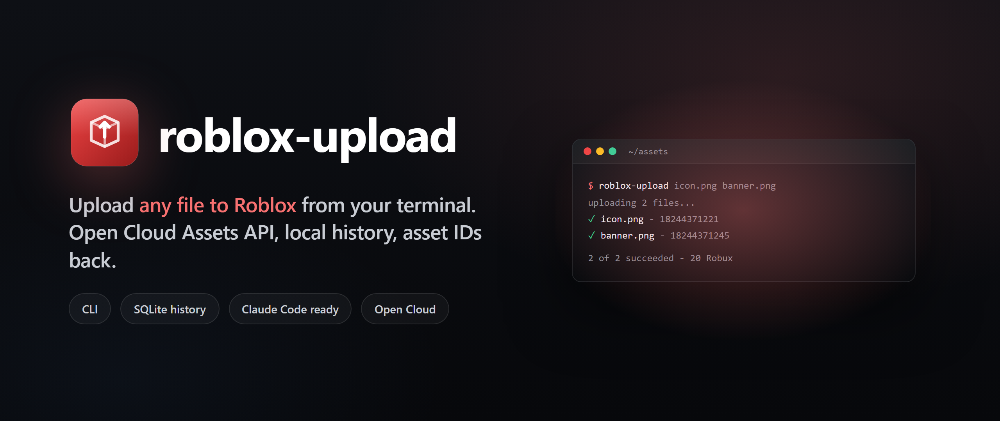

<p align="center">
  
</p>

<h3 align="center">
  Upload any file to Roblox from your terminal.
</h3>

<p align="center">
  Open Cloud Assets API, local SQLite history, asset IDs straight back. Built for Claude Code.
</p>

<p align="center">
  <a href="LICENSE"></a>
  
  
</p>

<p align="center">
  
  
  
</p>

---

Universal CLI + local dashboard for uploading assets to Roblox via the Open Cloud Assets API. Built so any Claude Code session can upload files and get back asset IDs without ever opening Roblox Studio.

## Why

Doing this in Studio is: open Asset Manager → click Upload → pick file → wait → copy ID, repeated per file. This wraps the official Open Cloud API into one command and stores every upload in a local SQLite history with a small dashboard.

## API key (per-session, never stored)

This tool deliberately does **not** persist your API key. Every shell session must export it explicitly.

1. Create a key at https://create.roblox.com/dashboard/credentials
   - System: **Assets**
   - Permissions: **Read** + **Write**
   - Add your current public IP to the allowlist
2. Export it for the session:
   - PowerShell: `$env:ROBLOX_API_KEY = "<your-key>"`
   - bash: `export ROBLOX_API_KEY=<your-key>`
3. (Optional) Set a default creator: `$env:ROBLOX_CREATOR = "user:12345"`

Verify: `roblox-upload check --creator user:12345`

## Commands

```bash
roblox-upload upload <files...>   # upload one or many files (or a directory)
roblox-upload history             # recent uploads as JSON
roblox-upload stats               # totals
roblox-upload dashboard           # opens http://127.0.0.1:7787
roblox-upload check               # verify env, no upload
```

Flags: `--creator user:<id>|group:<id>`, `--asset-type Decal|Audio|Model|Video`, `--name`, `--description`, `--session-label`, `--json`.

## Cost

Most uploads cost 10 Robux each on the user's account.

## Storage

- SQLite DB: `~/.roblox-upload/data.db`
- Dashboard: `http://127.0.0.1:7787` (uploads + logs, search + filter, click asset ID to copy)

## Install

```bash
git clone <repo-url> ~/Development/roblox-upload
cd ~/Development/roblox-upload
npm install
npm link              # puts `roblox-upload` on your PATH
roblox-upload setup-claude   # tell Claude Code on this device about the tool
roblox-upload check --creator user:<id>   # verify
```

`setup-claude` adds a self-contained block to `~/.claude/CLAUDE.md`. It's idempotent - re-run it after `git pull` to refresh the block.

## Cross-device

This repo is the source of truth. Per device you need:
1. `git clone` + `npm install` + `npm link`
2. `roblox-upload setup-claude` (so Claude Code on that machine auto-discovers it)
3. Export `ROBLOX_API_KEY` per shell session

The upload history (`~/.roblox-upload/data.db`) stays per-device by design.

## License

[MIT](LICENSE).
